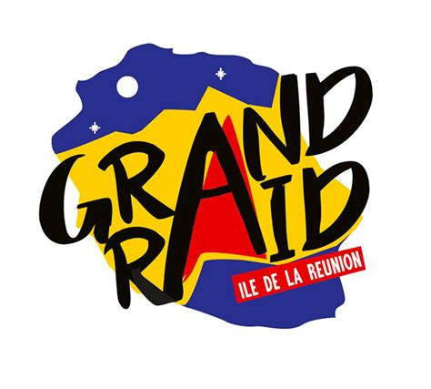

# Grand Raid de la Réunion
 Data-science project to explore the famous Grand Raid de la Réunion trail race competition

## Table of Contents
* [General Info](#General-Information)
* [Technologies Used](#Technologies-Used)
* [I. Data scraping](#I-Data-scraping)
* [II. ](#II-Data-exploration)

### General Information
The Grand Raid de la Réunion, also called La diagonale des fous (The Bishops'/Madmen's Diagonal) is a mountain ultramarathon race. The race takes place annually in October on Réunion island, a French overseas department in the Indian Ocean, situated between Madagascar and Mauritius. The 162 km route with 9643 m of elevation gain is reputed to be highly challenging, brutally difficult and one of the hardest footraces in the world.

https://www.grandraid-reunion.com/francais/resultats/?annee=2021&course=GR

### Technologies Used
- PYTHON3 - version 3.9: Pandas, Matplotlib, Seaborn, beautifulsoup, selenium

### I. Data scraping

[Data scraping NOTEBOOK](./1_Scraping/GRR-Scraping.ipynb)

We scrape results data for the 2021 edition of the race.

### II. Data exploration

[EDA NOTEBOOK](./2_EDA/GRR-EDA.ipynb)

We then explore some aspects of the demographics, race track and race strategies. (larger study with older editions and strava data in progress)

